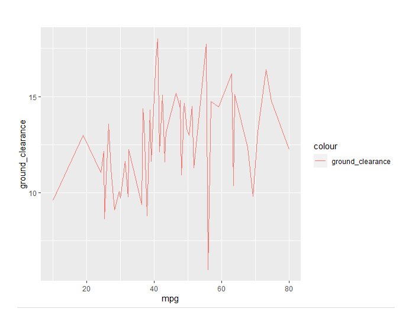

# MechaCar_Statistical_Analysis
Statistics Using R

## Linear Regression
### Linear Regression Overview
This analysis uses multiple linear regression to try to better understand the effect of certain factors on miles-per-gallon
### The Data
The data is composed of 6 variables (columns) and 50 rows (records ):
1. vehicle length, a decimal number
2. vehicle weight, a decimal number
3. spoiler angle, a decimal number
4. Ground clerance, a decimal number
5. All Wheel Drive (AWD), a binarynumber where 1 represents true and 0 represents false

### Hypothesis
the hypothesis we will use is 
H0 = There is 0 effect of vehicle_length, vehicle weight, spoiler angle, ground clearance and AWD on mpg
Ha = There is an effect from one or more of vehicle_length, vehicle weight, spoiler angle, ground clearance and AWD on mpg.
Another way of stating the Ho hypothesis is that the slope of the line is 0.
We will use a significance factor of .05 to provide the threshold for judging our hypothesis.

### Steps taken
1. The data was brought into RStudio into a table, multiple_reg_model.
2. Since AWD is a binary 1 or 0, this variable was turned into a catagorical factor 
3. Initially an ANova correlaton test was done. This was done to get an initial understanding of which of the 5 variables were correlated to mpg and by how much. See Figure 1.

Figure 1.

Looking at the P values (Pr(>F)), vehicle length and ground clearance are significantly below a .05 significance. Additionaly, vehicle weight is below .05, though not by much.  We reject all three vaiables as being just random and having no effect on mpg. They do have an effect.
spoiler angle and AWD are above the .05 significance threshlod and thus we can not reject the null hypothesis.

Now we move to multiple linear regression.
Looking at the initial results of the multiple linear regression, figure 2.

Figure 2

we can see the following:
1. the y intercept = -104
2. the vehicle length = 6.267
3. the vehicle weight = .001245
4. the spoiler angle = .06877
5. the ground clearance = 3.546
6. the AWD = -3.411
Looking at these on a graph together is confusing and doesn't provide a good picture. Instead lets look at these individually.

Figure 3, vehicle Length vs mpg shows a good upward slope.

Figure 3.

Figure 4, vehicle weight vs mpg appears t have a slight upward slope.

Figure 4.

Figure 5, Spoiler angle vs mpg shows hardly any slope.

Figure 5.

Figure 6, ground clearance vs mpg shows a noticiable upward slope.

Figure 5.

Figure 6, AWD vs mpg sshows that AWD vehicle miles per gallon varies a lot. Remember that this is a bianary variable, 1 for AWD and 0 for non-AWD

Figure 6

Now, lets look at the r values to confirm our guesses by looking at the individual plots.

Figure 7 shows the results.

Figure 7.

## Summary - Linear Regression to Predict MPG
Remember we are using a significance factor of .05. Based on this and looking at the P values (Pr(>|t)) we can see that:
1. the y intercept, vehicle length and ground clearnace are below the 0.05 significance level. We reject the null hypothesis, H0, that the slope of the line is 0. In other words, those variables effect to the mpg is more than just random.
2. Spoiler angle at .3069, AWD at .1852 and vehicle weight at .0776 are above the 0.05 significance level.  We do not have sufficient evidence to reject H0. They are likely to provide random amounts of variance to the model
4. with a an overal p value of 5.35e-11 (0.0000000000535) we definitely can not say the the slope is 0. Additionally, we can look at the above fugures and see that some of the variable have a non 0 slope.
Also, look at the multiple R-squared value. It is 0.7149. This value indicates that the regression model does predict mpg for the MechaCar prototypes, though the model is not perfect. My recommendation is to remove spoiler angle, AWD and vehicle weight and run it again.
I did that. See figure 8.

Figure 8.
Now that all the P values are below the significance factor (they all contribute to mpg) we see that the R-Squard for the model is .674 vs .7149 for the model with all the variables included. We did loose a little in fit. comparing the two models I believe there are other factors that were not taking into account that also contribute to mpg.

## Summary Statistics on Suspension Coils
### Suspension Analysis Overview
This analysis is conducted on a dataset from MechaCar that contains wieght capacities of suspension  coils in psi from multiple production lots classified by vehicle ID. The goal is to determine if the manufacturing process is consistent across production lots.
### The Data
The data consists of 3 columns and 150 rows
1. VehicleID = string - unique
2. Manufacturing_Lot = string - catagorical
3. PSI = decimal - numerical and continuous

### Steps Taken
1. The csv file was read into RStudio and explored for errors and inconsistencies
2. Summary statistics were calculated for the PSI variable. See figure 9.

Figure 9.

Note that the mean and median differ by very little indicating a symmetrical distribution. Also the standard deviation and variance are fairly small. This can by visually seen in figure 10.

Figure 10.

3. Based on this the summary statistics was re run but this time the data was grouped by Manufacturing_Lot. See figure 11.

Figure 11.
The standard deviation for each of these lots is also fairly small but the the vaiance for lot 3 seems large.

### Suspension Analysis Summary
The accpetance criteria for the suspension coils is that variance is smaller then 100. We can see right away that lot 3 does not meet that criteria when viewed by lot. Thus, overall the coils do fall within the variance threshold but lot 3 does not pass when viewed by itself. We can see this by looking at Figure 12. The blue line is the mean and the two red lines are the variance.

Figure 12.

## T - Test on Suspension Coils
Another statistical test to understand if the means of samples or populations are equal is to conduct a T test. Here we will first conduct a T test for the entire population of PSI's using a mean of 1,500. Then conduct a T test on the 3 lots against a mean of 1,500.

### T Test against the population
Using 1,500 as a mean I conducted three tests. All three tests are shown in Figure 13.

Figure 13.
This T-test is a two sided T test. Based on the P value of 0.5117 and the following hypotheses
H0 : There is no statistical difference between the observed population mean and 1,500.
Ha : There is a statistical difference between the population mean and 1,500.
we do not have sufficient evidence to reject the null hypothesis. 

### Manufacturing Lot T Tests
Here we tested each of the 3 lots against the mean of 1,500.

Looking at figure 14 we can see that for lot 1 the P value is .9048. This is significant so we can not reject the null hypthesis.

Figure 14.

In figure 15, for lot 2, we can see that the P value is .3451. As with lot 1 we can not reject the null hypoothesis.

Figure 15.

Finally, lot 3 T test result is shown in figure 16. As with lots 1 and 2, we cannot reject the null hypothesis

Figure 16.

### T Test Summary
Looking at the MechaCar data as a whole, Production variance is within tolerance but when we look  at variance by lot, lot 3 does not pass as the variance is 220.01. We cannot say that the means for PSI for all three losts, or the PSI as a whole, vary significantly based on a 0.05 significance factor.

## Study Design: MechaCar vs Competition
Based on the multiple linear regression conducted, I believe there are other factors that could be used to better understand. Remember that vehicle length and ground clearnace are statistically significant. but  Spoiler angle, AWD  and vehicle weight are not statistically significant. The inclusion of aerodynamics, horsepower and electronic cylinder control (the electronics that control the number of cyclinders used and turns the car off while stopped) should be anlyzed using ANOVA, correlation and Multiple linear regression to find those factors that are most critical to mpg. The hypothesis for tis testing would be:
H0 = There is 0 effect of aerodynamics, horsepower and electronic cylinder control on mpg.
Ha = There is an effect from one or more of aerodynamics, horsepower and electronic cylinder control on mpg.

Based on these results the significant factors the same testing should be done again but this time on vehicle cost. The hypothesis for this would be:
H0 = There is 0 effect of vehicle length, ground clearnace aerodynamics, horsepower and electronic cylinder control on vehicle cost.
Ha = There is an effect from one or more of vehicle length, ground clearnace aerodynamics, horsepower and electronic cylinder control on vehicle cost.

The results of this testing provide two pieces of information:
1. They can predict what can be affected along the slope of the line; what changes can be made
2. They can be used to narrow down where to focus manufacturing and manufacturing controls that will provide the most significant results.

These manufacturing controls would use T-Tests after verfying normality.

The above data would be needed for competitor cars as well as MechaCar and in sufficient quantity to satisfy the law of large numbers to make sure the distribution converges to a normal distribution. 

 

